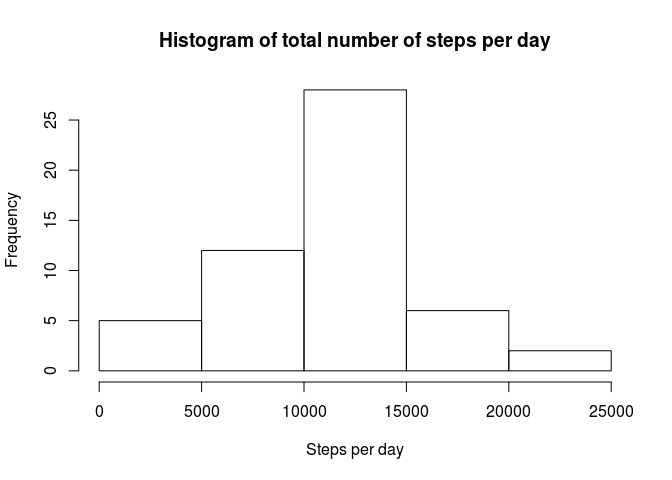

# Reproducible Research: Peer Assessment 1
Stuart Malcolm  
19 July 2015  

## Loading and preprocessing the data

The Activity data is loaded from a CSV file. Note that the current working directory will change if this file is moved somewhere else.

The CSV file contains 3 variables (columns):

- steps. Number of steps taken in 5 minute period (numeric)

- date. Date of 5 minute period YYYY-MM-DD

- interval. Identifier for 5-minute period (numeric) 

The data is loaded in its raw form (rawdata) and then any partial rows (where at least one field contains NA) are dropped (cleandata)


```r
setwd("~/projects/R/repdata-036/RepData_PeerAssessment1")
rawdata <- read.csv("activity.csv",colClasses = c("numeric","Date","numeric"))
cleandata <- rawdata[complete.cases(rawdata),]
```

Ok, lets have a quick look at the raw and clean data, and some summary statistics.


```r
head(rawdata)
```

```
##   steps       date interval
## 1    NA 2012-10-01        0
## 2    NA 2012-10-01        5
## 3    NA 2012-10-01       10
## 4    NA 2012-10-01       15
## 5    NA 2012-10-01       20
## 6    NA 2012-10-01       25
```

```r
summary(rawdata)
```

```
##      steps             date               interval     
##  Min.   :  0.00   Min.   :2012-10-01   Min.   :   0.0  
##  1st Qu.:  0.00   1st Qu.:2012-10-16   1st Qu.: 588.8  
##  Median :  0.00   Median :2012-10-31   Median :1177.5  
##  Mean   : 37.38   Mean   :2012-10-31   Mean   :1177.5  
##  3rd Qu.: 12.00   3rd Qu.:2012-11-15   3rd Qu.:1766.2  
##  Max.   :806.00   Max.   :2012-11-30   Max.   :2355.0  
##  NA's   :2304
```

## What is mean total number of steps taken per day?

We Sum the number of steps taken by Date to get the total number of steps taken per day. Then view this data as a histogram.


```r
total.daily.steps <- aggregate(cleandata$steps, by = list(as.factor(cleandata$date)), FUN=sum)
names(total.daily.steps) <- c("date","steps.per.day")
hist(total.daily.steps$steps.per.day,main="Histogram of total number of steps per day",xlab="Steps per day")
```

 

Lets look at the summary statistics for the total number of steps per day, specifically the Mean and Median values.


```r
summary(total.daily.steps$steps.per.day)
```

```
##    Min. 1st Qu.  Median    Mean 3rd Qu.    Max. 
##      41    8841   10760   10770   13290   21190
```

## What is the average daily activity pattern?

**[TODO]**

## Imputing missing values

**[TODO]**

## Are there differences in activity patterns between weekdays and weekends?

**[TODO]**
